# PRAYAS Campus Tour Platform

An operations platform for PRAYAS, Rural Development Centre (RDC), IIT Hyderabad, starting with its Campus Tour programme: schools and colleges bring students to the campus for a full-day visit to the library, labs, sports complex and other venues.

Today a visit is arranged over calls, messages and spreadsheets. This platform gives schools one place to request and manage a visit, and gives PRAYAS staff one place to review requests, enforce capacity rules and hand work to the right domain.

**Status:** Phase 1 and the first milestone of Phase 2 are complete and running locally. The project is not deployed yet. See [Roadmap](#roadmap) for what is still to come.

## Screenshots

### For schools and colleges

A five-step request form that needs no login:

| 1. School and contact | 2. Visit details | 3. Venues | 4. Logistics |
| --- | --- | --- | --- |
| [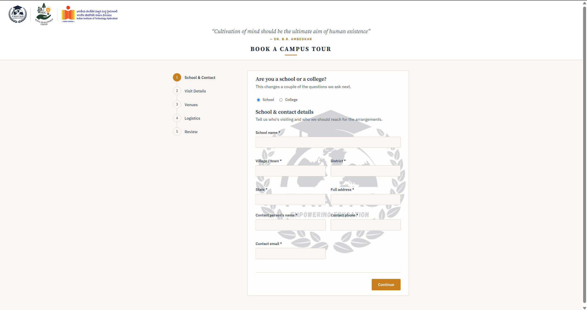](docs/schools/step-1-school-contact.png) | [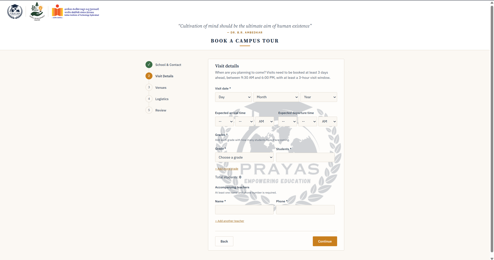](docs/schools/step-2-visit-details.png) | [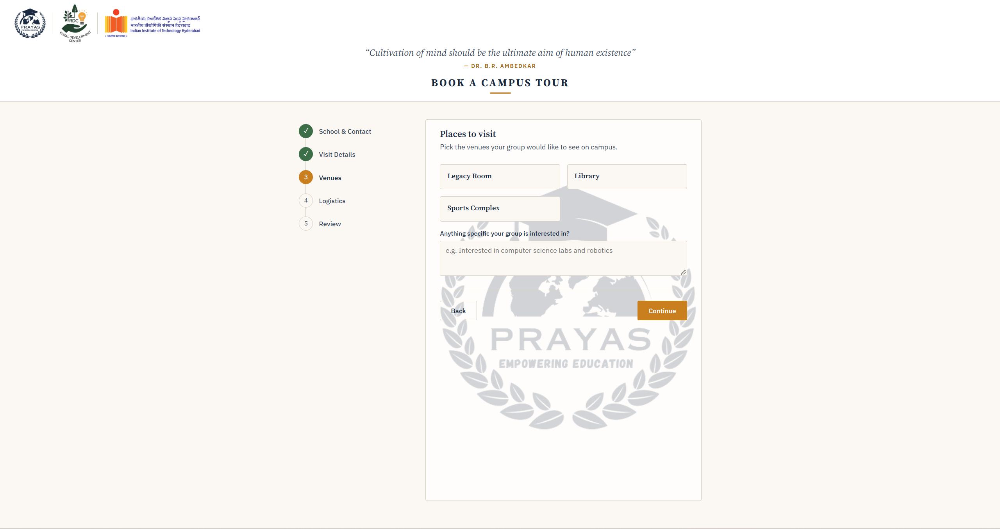](docs/schools/step-3-venues.png) | [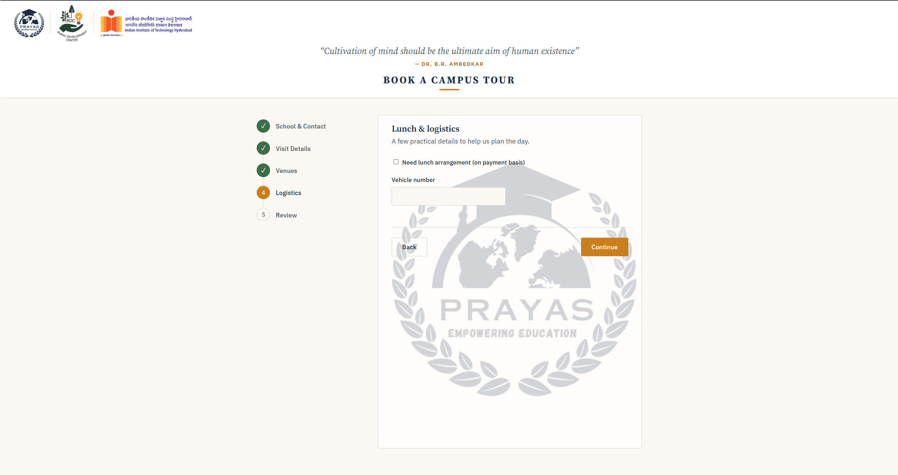](docs/schools/step-4-logistics.png) |

| 5. Review before sending | Request sent, with a private tracking link |
| --- | --- |
| [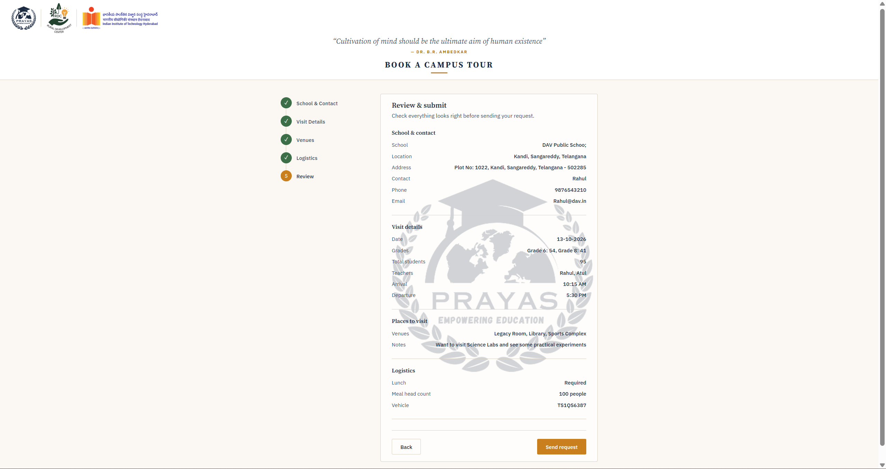](docs/schools/step-5-review.png) | [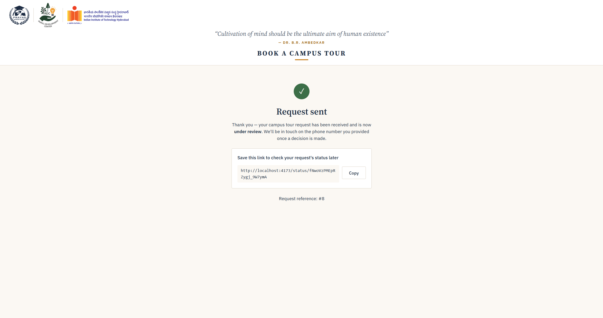](docs/schools/request-sent.png) |

**A repeat request is blocked** while the same school or contact number already has a pending or approved one:

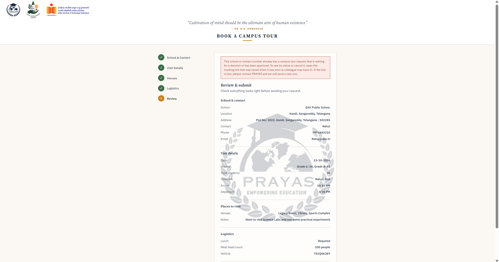

### For staff

| Sign in | Coordinator view (read-only) |
| --- | --- |
| [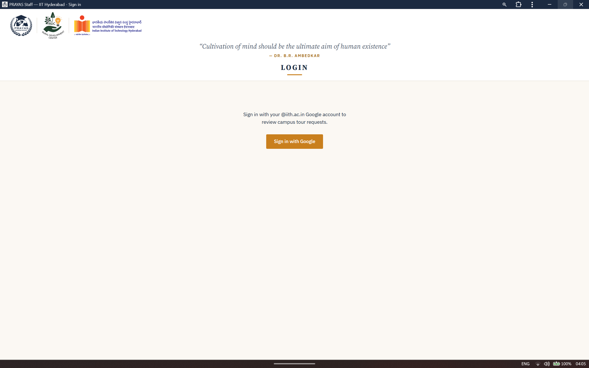](docs/staff/sign-in.png) | [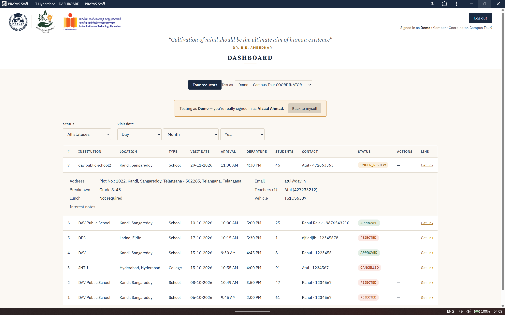](docs/staff/dashboard-coordinator.png) |

**Lead and faculty in-charge dashboard**, with approve, reject and reopen:

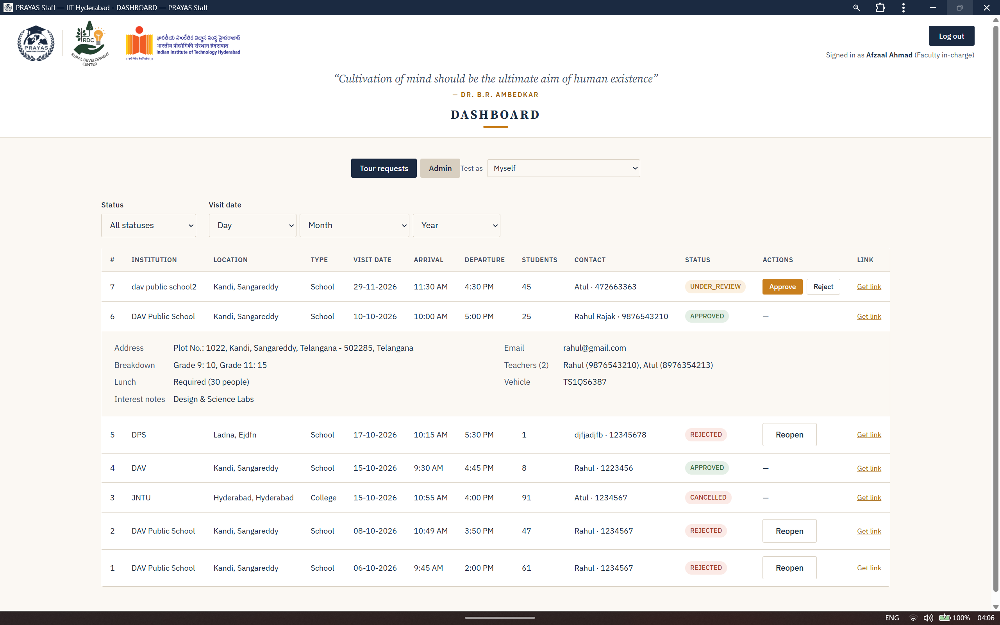

| Venues | Approval contacts | Staff and roles |
| --- | --- | --- |
| [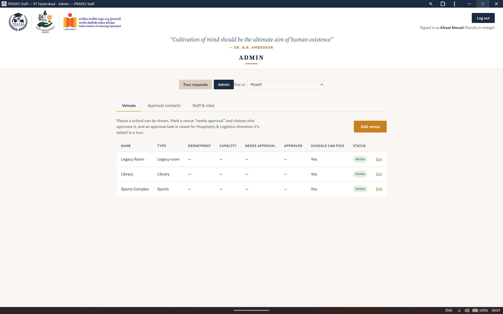](docs/staff/admin-venues.png) | [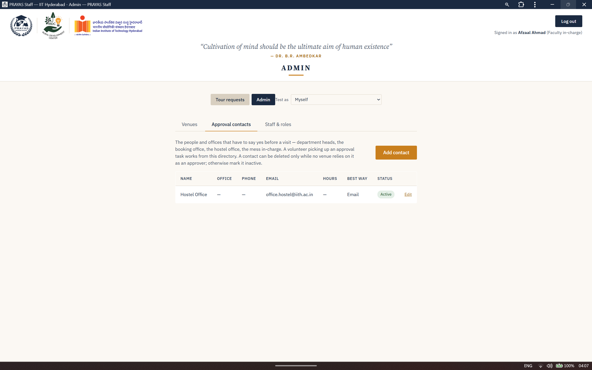](docs/staff/admin-approval-contacts.png) | [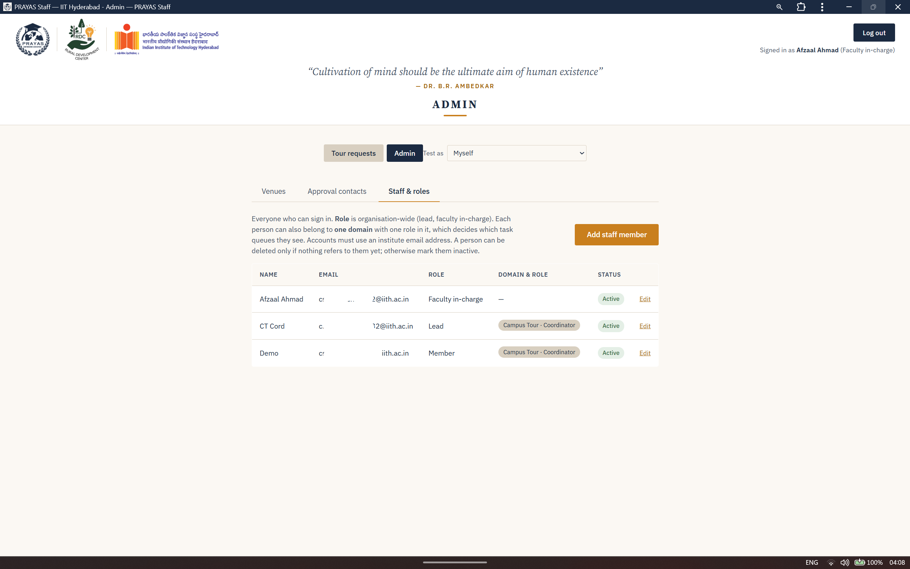](docs/staff/admin-staff-roles.png) |

## Features

### For schools and colleges (no login needed)

- A five-step request form: school and contact, visit details, venues, logistics, review and submit.
- School or college mode, which changes the questions asked (grades for schools; course and year for colleges).
- A private tracking link issued on submission, where the school can:
  - see the status of the request and any note from staff,
  - revise the headcount, grade by grade, until the freeze date,
  - change the lunch requirement,
  - ask for a different date and time,
  - cancel the request.

### For staff (Google sign-in, institute accounts only)

- A dashboard listing every request, with status and visit-date filters.
- An expandable detail view per request: address, contacts, teachers, grade breakdown, lunch, vehicle number.
- Approve, or reject with a reason that the school sees on its tracking page.
- Reopen a rejected request (Lead or Faculty in-charge only, reason required).
- Issue a fresh tracking link for a school that lost theirs.
- Installable as an app on phone or laptop (PWA).

### For leads and faculty in-charge

- Venue management: type, capacity, whether a visit needs approval, and who approves it.
- A directory of approval contacts (department heads, hostel office, mess in-charge).
- Staff and role management, with guards so an admin cannot lock themselves out.

## Engineering highlights

**A daily cap that holds under concurrent approvals.** Only a fixed number of tours can be approved per day (3 by default). Approval decisions for the same date are serialised with a PostgreSQL advisory lock keyed by the visit date, combined with optimistic locking on the entity. An integration test fires simultaneous approvals at a real Postgres database and checks the cap is never exceeded. That test caught a real bug: the status change was being flushed before the cap was counted, so a request counted itself.

**Tasks spawned across domains automatically.** PRAYAS has ten domains (Hospitality and Logistics, Volunteer Coordination, Transport and others). Approving a tour creates the tasks each domain owes it: lunch, volunteers, and venue approvals, the last only when a chosen venue needs one. This is built on a generic `Programme` and `Requirement` model, so future event types can reuse it.

**A public form protected without accounts.** Tracking tokens are stored only as SHA-256 hashes and shown once. The submit endpoint has per-IP rate limiting (Bucket4j) with a "try again at" time, a honeypot field, and a server-side CAPTCHA verification hook.

**Domain-scoped permissions.** Each person has a global role (Faculty in-charge, Lead or Member) plus a role within one domain (Head, Coordinator or Volunteer). Authorisation is checked on the server, and the interface shows only what the signed-in person can do.

**Business rules enforced on both ends.** Minimum notice before a visit, permitted visiting hours, minimum visit length, and a headcount freeze before the visit date are all configurable, validated in the browser for fast feedback and again on the server.

**Other details.** Versioned schema migrations with Flyway, an audit log of decisions, and consistent JSON error responses.

## Tech stack

| Layer | Technology |
| --- | --- |
| Backend | Java 21, Spring Boot 3, Spring Security (OAuth2 login), Spring Data JPA |
| Database | PostgreSQL 15, Flyway |
| Frontend | React, TypeScript, Vite, React Router, Axios |
| App install | vite-plugin-pwa (Workbox service worker) |
| Testing | JUnit integration and service tests against a real PostgreSQL database |

## Project structure

```
prayas-backend/     Spring Boot REST API
prayas-frontend/    React app: public form, tracking page, staff dashboard, admin
```

## Running locally

You need Java 21, Maven, PostgreSQL 15 and Node.js (LTS).

### 1. Create the database

In `psql`, as the postgres superuser:

```sql
CREATE DATABASE prayas;
CREATE USER prayas WITH PASSWORD 'changeme';
GRANT ALL PRIVILEGES ON DATABASE prayas TO prayas;
\c prayas
GRANT ALL ON SCHEMA public TO prayas;
```

### 2. Set environment variables

| Variable | Purpose |
| --- | --- |
| `DB_PASSWORD` | Database password. Defaults to `changeme` for local use. |
| `GOOGLE_CLIENT_ID` | Google OAuth client ID, needed for staff sign-in. |
| `GOOGLE_CLIENT_SECRET` | Google OAuth client secret. |

Create the Google OAuth client as a web application with the redirect URI `http://localhost:8080/login/oauth2/code/google`.

### 3. Start the backend

```
cd prayas-backend
mvn spring-boot:run "-Dspring-boot.run.profiles=local"
```

Flyway creates the tables on first start. The API runs at `http://localhost:8080`. To check it, open `http://localhost:8080/api/v1/public/venues`, which should return the seeded venues as JSON.

### 4. Start the frontend

```
cd prayas-frontend
npm install
npm run dev
```

The app runs at `http://localhost:5173`:

| Path | Page |
| --- | --- |
| `/` | Public request form |
| `/status/<token>` | Tracking page for a submitted request |
| `/staff` | Staff dashboard |
| `/staff/admin` | Admin page (Lead and Faculty in-charge) |

Staff sign-in works only for accounts that exist in the `app_user` table. Create the first Lead account directly in the database, then add everyone else from the admin page.

### Running the tests

The tests use a separate database named `prayas_test`, created the same way as `prayas`.

```
cd prayas-backend
mvn test
```

## Roadmap

Phase 2 continues in this order:

1. **Itinerary builder.** Ordered stops for each approved tour, checked against the visit window and against other schools using the same venue at the same time.
2. **Approval workflow engine.** Step-by-step chains such as lab permission from a department head, classroom booking, and the two-step mess lunch approval.
3. **Task queues.** A Hospitality and Logistics queue and a "My tasks" page, with optional proof upload.
4. **Readiness tracking.** Status on each itinerary stop, rolled up to the dashboard.

Planned after that: assigning coordinators and volunteers by availability, photo check-ins by volunteers during a tour, and deployment.

## Known limitations

These are open items to close before deployment:

- CSRF protection is currently switched off for the API during local development and needs to be restored for the browser-based staff pages.
- The CAPTCHA widget is not wired into the public form yet; the local profile uses a stub verifier.
- Lead and Faculty in-charge currently have identical access.
